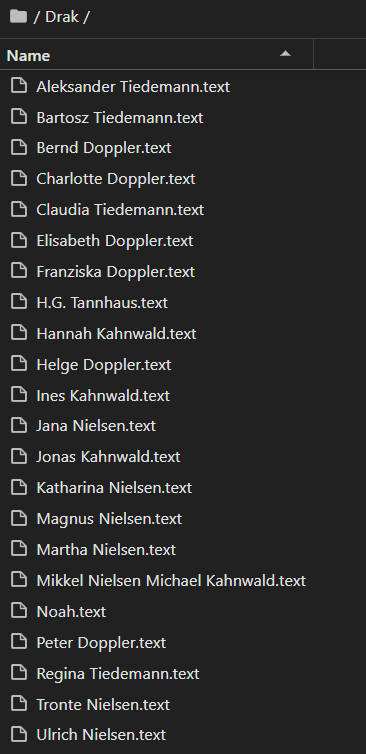
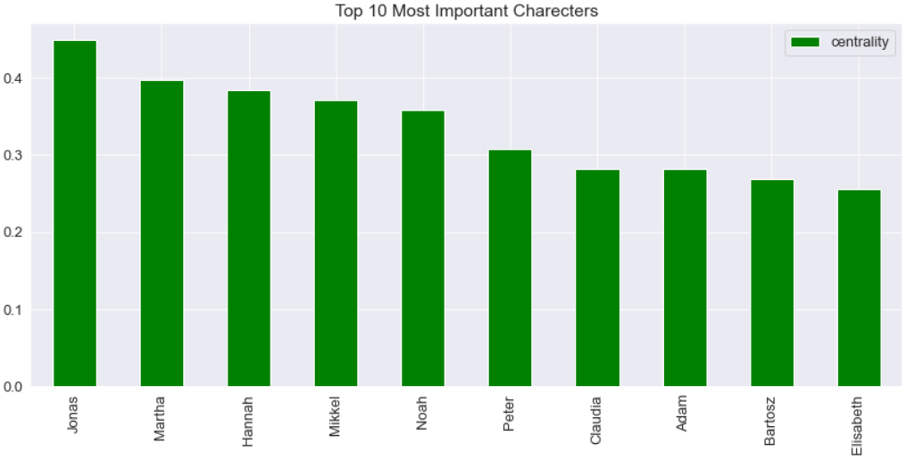
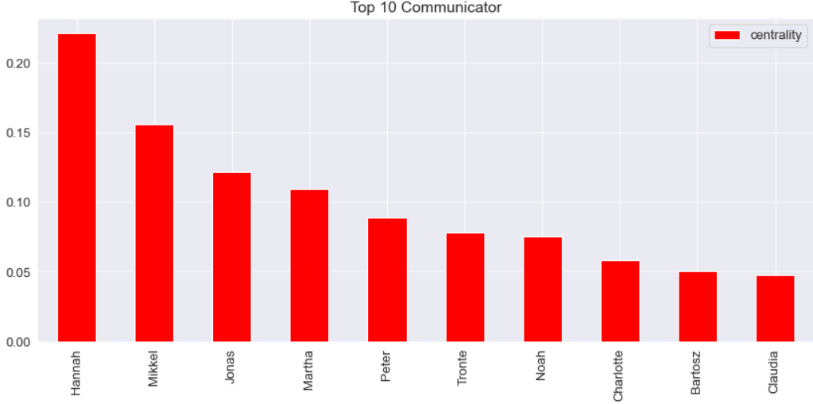
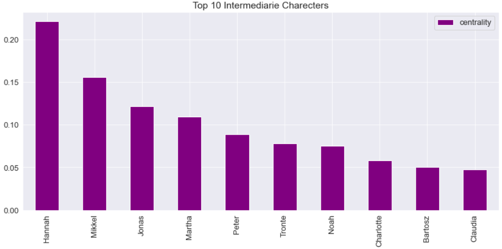

# Graph Analysis and Relationship Extraction of Dark Tv Series
If you have watched the Dark series produced by Netflix, you know that understanding this series and the relationship between the characters can be a bit challenging :D . In this project, I used biographies of serial characters and NLP and Graph Analysis to determine the relationship between serial characters and their importance.

## Project Overview : 
### 1- Scraping characters biography 
 
 
### 2- Extracting .text Files and Combine Them All Together
### 3- Extracting Relationships from Characters Biography
### 4- Extracting Characters Names and Edging Based on Their Relationships
### 5- Ploting Relationships Graph
- ### 🟣 Most Important
- ### 🔴 Semi Important
- ### 🟡 Moderate Important
- ### 🟢 Secondary characters
- ### 🔵 NPCs
 

### 6- Who Are The Top 10 Most Important Charecters in Tv Show
 

### 7- Who Are The Top Top 10 Intermediarie Charecters in Dark
 

### 8- Who Are The Top 10 Communicator in Dark
 

